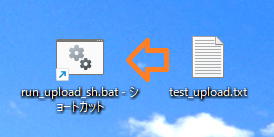

# WindowsでショートカットへドロップしたファイルをLinuxへアップロードする方法

## はじめに

Linuxへ一つだけファイルをアップロードするのに、scpコマンドを書くのも、クライアントを起動するのも面倒な人(自分)向け

ファイル(or フォルダ)をドラッグアンドドロップだけでサーバーへ転送する、ショートカットファイルの作り方です




* 要git-bash(gitインストールすると入ってます)

## 仕組み

* 引数で渡したファイルをサーバーに転送するシェルスクリプトを作る
  * 引数のパスの区切り文字が異なるので置換する(\⇒/)
  * パスがディレクトリの場合は、tarで圧縮してからサーバーにアップロードして解凍する
  * ファイルの場合はそのままアップロードする
  * アップロード先はログインユーザーのhome(~/)ディレクトリ
* シェルスクリプトを実行するバッチファイルを作る
  * バッチファイルからドロップされたファイルパス(%1)引数につけて、シェルスクリプトを実行する
* バッチファイルのショートカットを作成する
  * ショートカット上でファイルがドロップされると、ドロップされたファイルパスを引数として実行される(Windowsの仕組み上)

## 作成するファイルと手順

### バッチファイル(run_upload_sh.bat)

* 引き渡されたファイルのフルパスは`%1`にセットされている
* base.exeを呼び出し、アップロードシェルスクリプトを実行する

```bat
@echo off
set scriptPath=./upload-drop-files.sh

"C:\Program Files\Git\bin\bash.exe" -c "%scriptPath% \"%1\"
```

### シェルスクリプト(upload-drop-files.sh)

* ssh経由でファイルをパイプして、ログイン先のホームディレクトリに保存
* `SSH_PARAM`(ssh接続用引数)は適宜書き換えてください
  * 鍵ファイルを利用する場合は、`-i *****.pem user@server`のような感じ
  * `.ssh/config`に設定済みの場合は、設定した名前

パスからファイル名などを取り出す方法については
[こちら(ファイルパスからファイル名や拡張子を自由に取り出す)](https://zariganitosh.hatenablog.jp/entry/20100921/get_file_name_ext_dir)をご参照ください

```sh
#!/bin/bash

# ssh接続用引数(-i *****.pem user@server)
SSH_PARAM=xxxxxx

ARG=${1//\\//} # パスの区切り文字を置換(\⇒/)

if [ -d "$1" ]; then
    # 引数がディレクトリの場合、圧縮してからアップロード(解凍も行う)
    UPD_PATH=${ARG%/} # パスの最後の'/'を削除(あってもなくても動作するように)
    DIR_NAME=${UPD_PATH##*/} # パスの最後のディレクトリ名

    echo "Upload '$UPD_PATH' directory to '~/$DIR_NAME'"
    tar -zcf - -C "$UPD_PATH/.." $DIR_NAME | ssh $SSH_PARAM "tar zxf - -C ~/"
else
    # 引数がファイルの場合、sshにパイプで渡してそのまま保存
    echo "Upload '$ARG' file to '~/${ARG##*/}'"
    cat $1 | ssh $SSH_PARAM "cat > ~/${ARG##*/}"
fi
```

### 設定手順

* 上記２つのファイルを任意の同一フォルダに保存
* バッチファイルのショートカットをデスクトップに作成する(デスクトップに右クリックでドロップして作成）
* 以上

### 使い方

ショートカットにファイル、フォルダをドロップすれば、sshでログインしたユーザーのホームディレクトリにアップロードされます（既に存在している場合、警告なしで上書きします）
